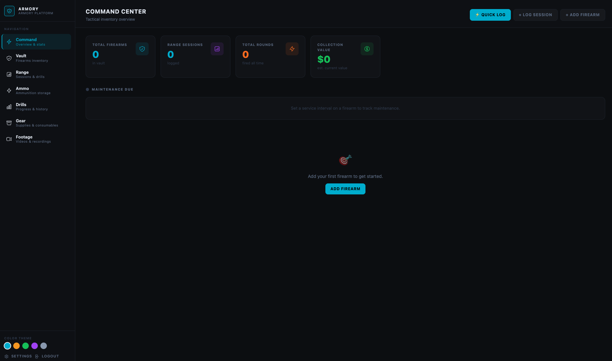
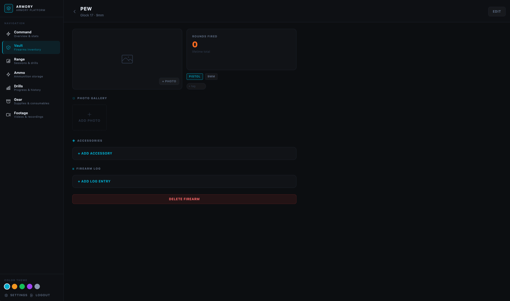
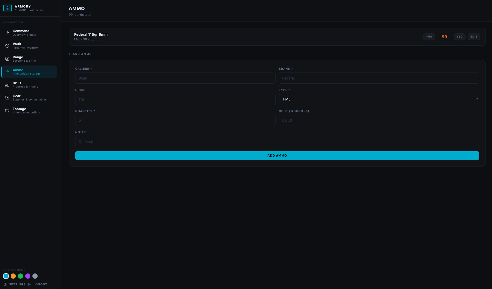

# Armory

A self-hosted firearms tracker and range log. Track your collection, log range sessions, manage ammo, and review footage — all stored locally on your own hardware with no cloud dependency.

- **Image:** `ghcr.io/matsukami7/armory-app:latest`
- **GitHub:** https://github.com/Matsukami7/armory-app

---

## Screenshots

| Dashboard | Firearm Detail | Ammo Inventory |
|---|---|---|
|  |  |  |

---

## Features

### Dashboard
- At-a-glance stats: total firearms, sessions, lifetime rounds, collection value vs. what you paid, and all-time ammo spend
- Maintenance due alerts — set a service interval per firearm and the dashboard flags overdue ones
- Low ammo and low gear stock warnings
- **⚡ Quick Log** button — log rounds to today's session in seconds without leaving the dashboard
- Recent sessions list

### Firearms
- Add each firearm with make, model, caliber, type, serial number, generation, and purchase info
- Track estimated current value separately from purchase price
- Upload a cover photo and an unlimited photo gallery per firearm
- Round count odometer — total lifetime rounds auto-summed from all sessions
- Label any firearm with color-coded tags; filter the vault by tag
- Attach accessories, maintain a log, and set a service interval for cleaning alerts
- 5 firearm types: Pistol, Rifle, Shotgun, Revolver, Other

### Accessories
- Attach accessories to any firearm: optics, lights, suppressors, grips, stocks, triggers
- Track make, model, and purchase price per accessory
- **Lights:** output in lumens, power source (rechargeable or battery), battery type, and last battery change date
- **Optics:** zero data field (distance, elevation/windage notes)
- Upload a photo per accessory
- Inline notes editable without leaving the page

### Firearm Log
- Per-firearm log: **Note**, **Cleaning**, **Repair**, **Inspection**, **Modification**
- Record round count at time of service — used to calculate rounds since last cleaning
- Maintenance interval alerts on the dashboard when a firearm is overdue

### Range Sessions
- Log sessions with date, location, duration, weather, and notes
- Location field autocompletes from previously used ranges
- Link firearms with rounds fired; ammo dropdown auto-filters to matching caliber
- Link ammo inventory to auto-deduct rounds on save
- Session cost calculated automatically (rounds fired × cost per round)
- Color-coded tags on sessions; filter the sessions list by tag
- **Compare** any two sessions side-by-side: rounds, cost, drill scores (green/red improvement indicators), firearms used

### Drills
- Log drills per session: name, distance, score/result, par time, notes, firearm, and target photo
- **Drill History** page groups all drills by name, sorted by most recently used
- Score trend charts for drills with numeric results (times, scores, etc.)
- Par time tracked as a second dashed series on trend charts — see if you're beating the clock over time
- Full history per drill with session links and target photo thumbnails

### Ammo Inventory
- Track ammo by caliber, brand, grain, and type (FMJ, HP, SP, Match, Subsonic, Other)
- Quick +50 / −50 round adjusters on the inventory page
- Cost-per-round tracking with auto-calculation
- **Purchase log** per ammo type: date, quantity, total cost, retailer — quantity updates automatically
- **Price trend chart** — cost-per-round charted over all logged purchases; shows when prices go up or down
- Low ammo dashboard alert when any type drops below 100 rounds

### Quick Log
- `/log` — minimal form for range use: pick firearm, enter rounds, optionally select ammo
- Automatically appends to today's session; creates a new session if none exists
- Ammo filtered by caliber automatically; round input auto-focused after firearm selection
- "View Today's Session" button appears once a session exists

### Gear / Consumables
- Track cleaning supplies, targets, batteries, tools, and safety gear
- Category tabs: Cleaning, Targets, Batteries, Tools, Safety, Other
- +1 / −1 quick adjusters per item
- Low stock threshold — dashboard and gear page alert when quantity is at or below threshold
- Freeform unit (bottles, oz, pcs, rolls, etc.)

### Video Footage
- **Footage library** (`/footage`) — upload video clips or link external recordings
- Inline video player with seek support for uploaded files (mp4, mov, webm, mkv)
- YouTube and Vimeo URLs embed automatically as players
- Any other URL shows as an external link
- Optionally link footage to a specific range session
- **Session clips** — upload short clips directly from the session detail page; they appear inline with a player

### Printable Range Card
- Generate a blank range card to take to the range for handwritten notes
- Pre-select firearms you're bringing — they populate the firearm column automatically
- Configurable number of firearm rows and drill rows
- Clean black-on-white print layout — app chrome hidden automatically when printing

### Settings & Backup
- One-click database download from Settings — no SSH required
- Vault summary: firearm, session, and ammo counts
- Default password warning until `ARMORY_PASSWORD` is changed

### Theming
- 5 color themes selectable per user: **Tactical** (cyan), **Ember** (amber), **Ranger** (green), **Void** (purple), **Ghost** (slate)
- Theme saved in a cookie — no flash on load

---

## Quick Start

**Requirements:** [Docker](https://docs.docker.com/get-docker/) and [Docker Compose](https://docs.docker.com/compose/install/). Nothing else.

```bash
mkdir armory && cd armory
curl -O https://raw.githubusercontent.com/Matsukami7/armory-app/master/docker-compose.yml
echo "ARMORY_PASSWORD=your-secure-password-here" > .env
docker compose up -d
```

Open `http://<your-server-ip>:4321`.

> **Default password is `changeme`.** A warning banner appears on every page until you change it.

---

## Usage Guide

### Adding your first firearm
1. Click **Vault** → **+ Add Firearm**
2. Fill in make, model, caliber, and type — everything else is optional
3. Save, then tap **+ Photo** on the detail page to attach a cover image
4. Tap the photo gallery section to add additional reference photos

### Logging a range session
1. Click **Range** → **+ Log Session** (or **⚡ Quick Log** on the dashboard for a fast entry)
2. Enter date and optionally location, duration, weather, and notes
3. On the session detail page, tap **+ Add Firearm** to record rounds fired per gun
4. Link an ammo type to auto-deduct from inventory
5. Tap **+ Log Drill** to record individual drills with score, par time, and target photo

### Tracking drills over time
- Go to **Drills** to see all drills grouped by name
- Any drill with ≥ 2 numeric scores gets a trend chart automatically
- If you log par times, they appear as a second dashed line on the chart

### Comparing sessions
- Click **Compare** on the Range page, pick two sessions, and view them side-by-side
- Drill scores show green ▲ / red ▼ indicators for improvement

### Managing ammo
1. Go to **Ammo** → **+ Add Ammo**
2. Use **+50 / −50** buttons to adjust counts manually
3. Tap **Edit** on any ammo entry to log purchases — each purchase auto-adds to inventory and logs for the price trend chart

### Tagging firearms and sessions
- On any firearm or session detail page, type a tag name in the tag input and press Enter
- Tags appear as colored chips — tap the **✕** to remove
- Filter the Vault and Range lists by clicking any tag chip

### Tracking gear
1. Click **Gear** → **+ Add Item**
2. Set a **Low Stock Alert** threshold — you'll see a warning on the dashboard and gear page when stock hits that level
3. Use **+1 / −1** buttons to adjust counts after each range trip

### Uploading footage
- **Short clips:** open a session, scroll to **Video Clips**, and upload an mp4/mov/webm file
- **Helmet cam / body cam:** go to **Footage** in the sidebar, click **+ Add Footage**, and either upload a file or paste a YouTube/Vimeo URL
- For large files (multi-GB recordings) that are impractical to upload through a browser, drop them directly into `data/uploads/footage/` on your server, then add an entry in the Footage library manually

### Maintenance reminders
1. On a firearm's **Edit** page, set a **Service Interval (rounds)**
2. Log a **Cleaning** entry in the firearm log each time you clean — record the round count at that moment
3. The dashboard flags the firearm when rounds since the last cleaning entry exceeds the interval

### Printing a range card
1. Click **Range** → **🖨 Range Card**
2. Check which firearms you're bringing and set row counts
3. Print — the config panel disappears and you get a clean card

---

## Data & Backups

All data lives in `data/` next to your `docker-compose.yml`:

```
data/
  armory.db          — SQLite database (all records)
  uploads/           — Photos and uploaded videos
    firearms/
    accessories/
    targets/
    footage/
```

**To back up:** copy the entire `data/` directory.

**To restore:**
```bash
docker compose down
cp -r /path/to/backup/data ./data
docker compose up -d
```

You can also download the database directly from the **Settings** page in the app.

---

## Updating

```bash
docker compose pull
docker compose up -d
```

Your `data/` directory is never touched during updates. Database migrations run automatically on startup.

---

## Configuration

All configuration via environment variables (`.env` or `docker-compose.yml`):

| Variable | Default | Description |
|---|---|---|
| `ARMORY_PASSWORD` | `changeme` | App password — **change this** |
| `DB_PATH` | `/data/armory.db` | Path to the SQLite database |
| `ORIGIN` | *(unset)* | Public URL — **required behind a reverse proxy** (e.g. `https://armory.example.com`) |
| `PORT` | `4321` | Port the app listens on |
| `HOST` | `0.0.0.0` | Bind address |

**Changing the port:**
```yaml
# docker-compose.yml
ports:
  - "8080:4321"   # exposes on 8080
```

**Behind a reverse proxy (nginx, Caddy, Traefik):**
The app runs plain HTTP — terminate TLS at your proxy and forward to `http://localhost:4321`. You **must** set the `ORIGIN` variable to your public URL or logins will be blocked by Astro's CSRF protection:

```bash
# .env
ORIGIN=https://armory.yourdomain.com
```

---

## Build from Source

```bash
git clone https://github.com/Matsukami7/armory-app.git armory
cd armory
cp .env.example .env    # edit ARMORY_PASSWORD
```

Edit `docker-compose.yml` and swap the image/build lines:
```yaml
# image: ghcr.io/matsukami7/armory-app:latest   ← comment out
build: .                                          # ← uncomment
```

```bash
docker compose up -d --build
```

**Local dev without Docker** (Node.js 22+ required):
```bash
npm install
ARMORY_PASSWORD=changeme npm run dev
# → http://localhost:4321
```

---

## Publishing an Update (Maintainers)

```bash
# Log in once
echo YOUR_GITHUB_TOKEN | docker login ghcr.io -u YOUR_GITHUB_USERNAME --password-stdin

# Build and push
docker build -t ghcr.io/matsukami7/armory-app:latest .
docker push ghcr.io/matsukami7/armory-app:latest
```

Token: GitHub → Settings → Developer settings → Personal access tokens → `write:packages`.

---

## Security Notes

- Designed for **local network use**. No multi-user support.
- If exposed to the internet, use a reverse proxy with HTTPS.
- Session cookie is `HttpOnly`, `SameSite=Strict`, 30-day expiry.
- Uploaded files are restricted to allowed extensions; path traversal is prevented server-side.
- Change the default password before putting the app on your network.

---

## Tech Stack

| Layer | Choice |
|---|---|
| Framework | [Astro](https://astro.build) v6, SSR |
| Styles | [Tailwind CSS v4](https://tailwindcss.com) |
| Database | SQLite via [Drizzle ORM](https://orm.drizzle.team) + [better-sqlite3](https://github.com/WiseLibs/better-sqlite3) |
| Runtime | Node.js 22 |
| Deployment | Docker Compose + GHCR |
